# DIO Azure AI Fundamentals

## Trabalhando com Machine Learning

Neste exemplo, usamos o recurso de aprendizado de máquina automatizado no Azure Machine Learning para treinar e avaliar um modelo de aprendizado de máquina. Em seguida, implantar e testar o modelo treinado.

Antes de prosseguir, é necessário possuir um workspace criado.

[Tutorial Workspace](https://microsoftlearning.github.io/mslearn-ai-fundamentals/Instructions/Labs/01-machine-learning.html#clean-up)

Com o nosso Workspace provisionado, iremos acessar o [Azure Machine Learning Studio](https://ml.azure.com/?azure-portal=true) e selecionar o workspace que iremos trabalhar:


Em seguida iremos criar um Novo trabalho de ML automatizado


## Criando um aprendizado de máquina para a previsão de aluguel de bicicletas

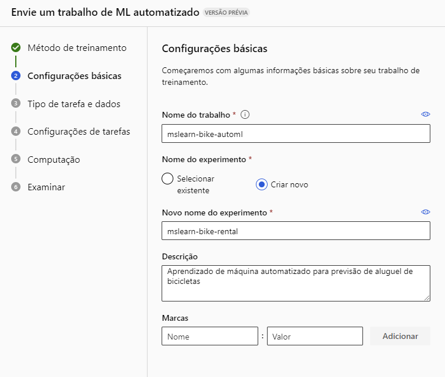  
**Configurações básicas :**

**Nome do trabalho :** mslearn-bike-automl  
**Novo nome do experimento :** mslearn-bike-rental  
**Descrição :** Aprendizado de máquina automatizado para previsão de aluguel de bicicletas  
**Marcadores :** nenhum

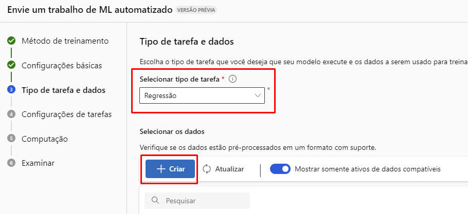
**Selecionar tipo de tarefa:** Regressão  

Em seguida criaremos um novo conjunto de dados:


**Tipo de dados:**  
**Nome:** bike-rentals  
**Descrição:** Historic bike rental data  
**Tipo:** Tabular  


Em Fonte de Dados, selecionamos **De arquivos na Web**


**URL da Web:** https://aka.ms/bike-rentals  

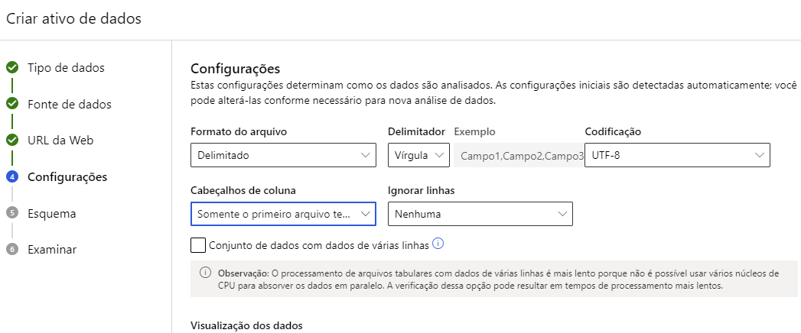
Em **Configurações** inserimos as seguintes informações  

**Formato de arquivo:** Delimitado  
**Delimitador:** Vírgula  
**Codificação:** UTF-8  
**Cabeçalhos de coluna:** Somente o primeiro arquivo possui cabeçalhos  
**Pular linhas :** Nenhum  
**O conjunto de dados contém dados multilinhas:** não selecione  

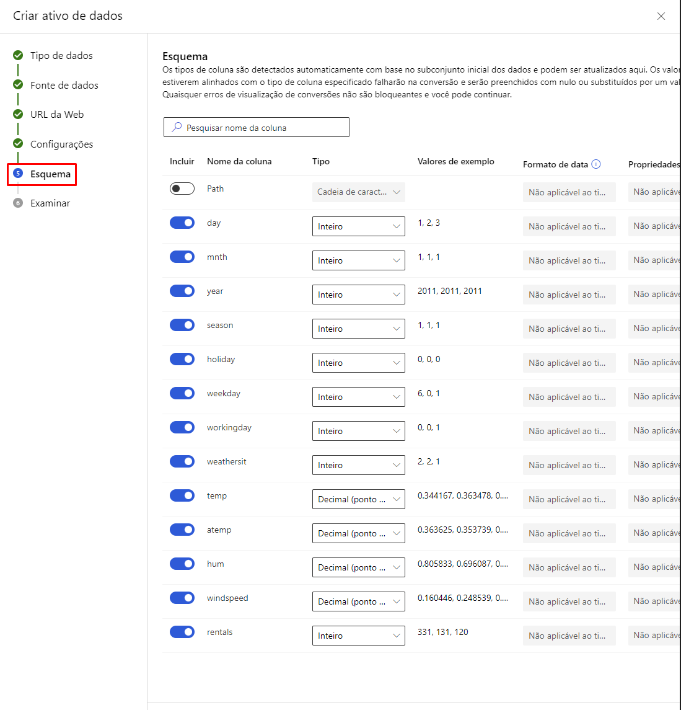

**Esquema:**  
* Incluir todas as colunas exceto Path  
* Revise os tipos detectados automaticamente  

### Após preenchidas as informações, verifique se estão  corretas e clique no botão "Criar"

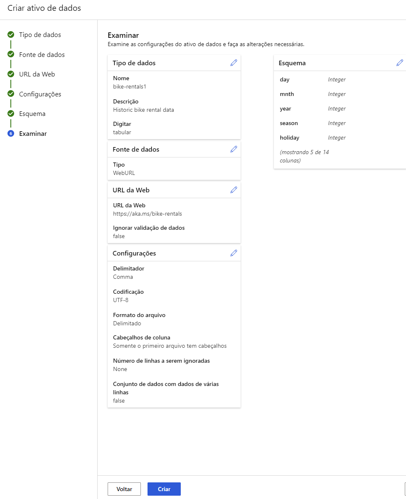

### Configurações de tarefa :

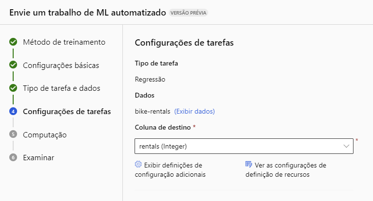

**Tipo de tarefa :** Regressão  
**Conjunto de dados :** aluguel de bicicletas  
**Coluna de destino :** Aluguéis (inteiro) 

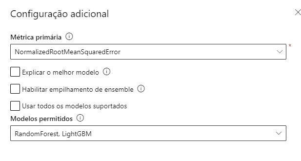

**Configurações adicionais :**

**Métrica primária :** Normalized root mean squared error  
**Explique o melhor modelo :** Não selecionado  
**Usar todos os modelos suportados :** Desmarcado . Você restringirá o trabalho para tentar apenas alguns algoritmos específicos.  
**Modelos permitidos :** Selecione apenas RandomForest e LightGBM — normalmente você gostaria de tentar o máximo possível, mas cada modelo adicionado aumenta o tempo necessário para executar o trabalho.  

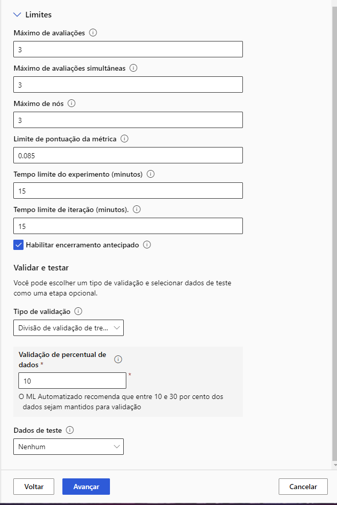

**Limites :** expanda esta seção  

**Máximo de testes :** 3  
**Máximo de testes simultâneos :** 3  
**Máximo de nós :** 3  
**Limite de pontuação da métrica :** 0,085 ( para que, se um modelo atingir uma pontuação da métrica de erro quadrático médio normalizado de 0,085 ou menos, o trabalho termina. )  
**Tempo limite :** 15  
**Tempo limite de iteração :** 15  
**Habilitar rescisão antecipada :** selecionado 

**Validação e teste :**  
**Tipo de validação :** divisão de validação de treinamento  
**Porcentagem de dados de validação :** 10  
**Conjunto de dados de teste :** Nenhum  


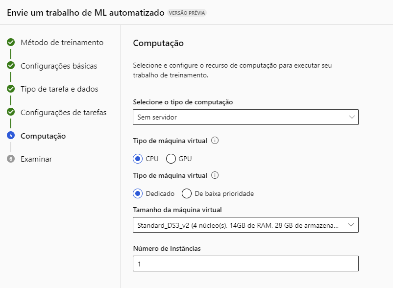

**Computação :**  
**Selecione o tipo de computação :** sem servidor  
**Tipo de máquina virtual :** CPU  
**Camada de máquina virtual :** Dedicada  
**Tamanho da máquina virtual :** Standard_DS3_V2*  
**Número de instâncias :** 1  


Após configurado, revisamos as informações inseridas e Enviamos o trabalho de treinamento.  
Aguarde o trabalho terminar, leva em média entre 10 a 15 minutos para este exemplo.


## Testando o modelo

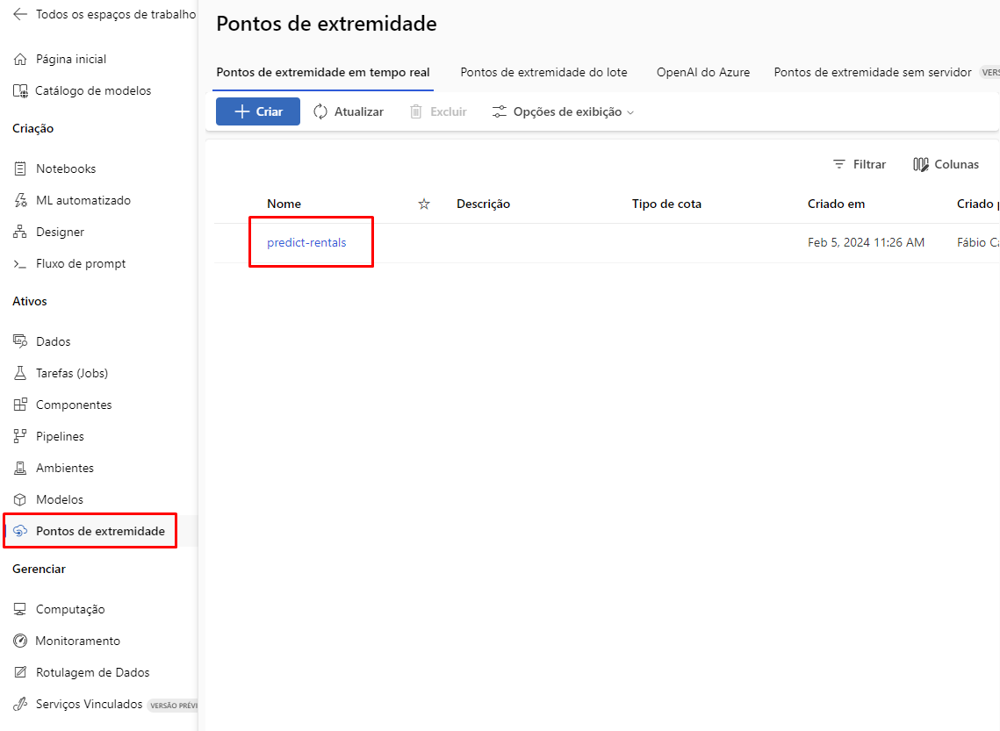
Após finalizar o trabalho de treinamento, iremos na guia **Pontos de extremidade** e selecionamos o trabalho que criamos.


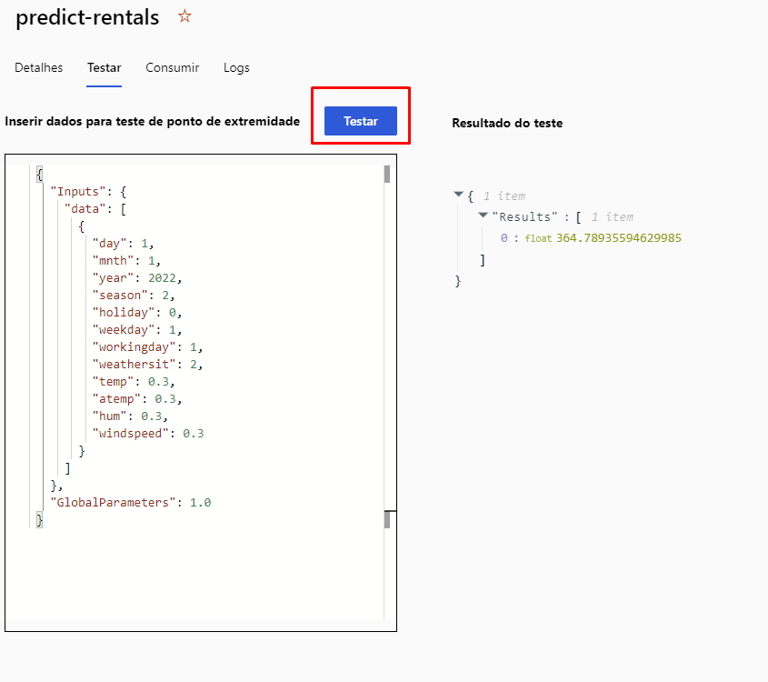
Para o teste, utilize o json abaixo e clicamos em Testar 
```
{
  "input_data": {
    "data": [
       {
         "day": 1,
         "mnth": 1,   
         "year": 2022,
         "season": 2,
         "holiday": 0,
         "weekday": 1,
         "workingday": 1,
         "weathersit": 2, 
         "temp": 0.3, 
         "atemp": 0.3,
         "hum": 0.3,
         "windspeed": 0.3 
       }
     ]
  }
}
```
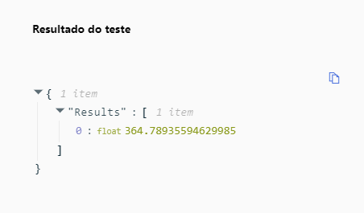

A previsão gerada foi: 364.78


